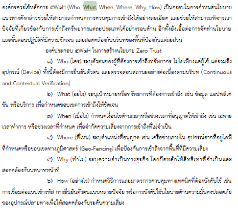
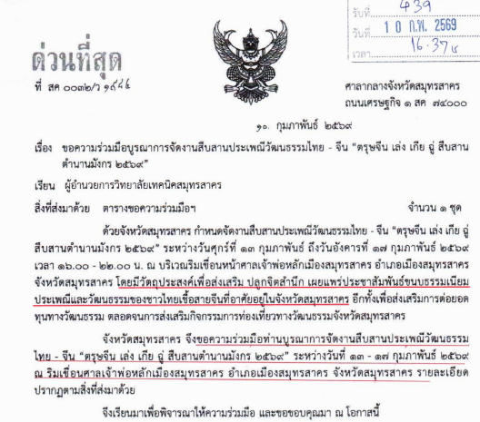

[<<back to Main](README.md)

---
# แนวปฏิบัติการใช้ซีโร่ทรัสต์ (Zero Trust Guidelines)
---
 
 
---
## หลักการ 5W1H 
--
    ผมเจอ "หลักการ 5W1H" ในการทำงาน โดยในงานของผมนั้นคือการรับเข้าเอกสารของวิทยาลัยเทคนิคสมุทรสาคร จากหน่วยงานภายนอก 
    จำเป็นต้องมีการขีดเส้นในในข้อความของเอกสาร เพื่อเป็นการสรุปใจความให้ท่านผู้อำนวยการ เพื่อประหยัดเวลา
    หัวหน้างานจึงสอนว่า "ให้ค่อยอ่านทุกบรรทัด โดยมองว่า ใคร! ทำอะไร! ที่ไหน! เวลาเท่าใด! จุดประสงค์หลักอะไร! ปฏิบัติอย่างไร! " 
    ซึ่งตรงกับหลักการนี้ในหนังสือพอดี (หน้าที่ 38 - ย่อหน้าที่ 2)

 ---
 # ตัวอย่าง

  

## จากตัวอย่าง

---

### Who : 

  จากเอกสารพบว่าไม่ได้มีเพียงหน่วยงานเดียว แต่เป็นความร่วมมือของหลายฝ่าย ได้แก่
  
           🫅 จังหวัดสมุทรสาคร (ผู้ริเริ่มและประสานงานหลัก)
           🫅 สำนักงานวัฒนธรรรมจังหวัดสมุทรสาคร (แม่งาน)
           🫅 หน่วยงานราชการและองค์กรในพื้นที่
           📜 วิทยาลัยเทคนิคสมุทรสาคร (ผู้รับหนังสือและผู้ร่วมบูรณาการ)
           🐉 ชุมชนไทยเชื้อสายจีนในจังหวัดสมุทรสาคร
           🐉 ศาลเจ้าพ่อหลักเมืองสมุทรสาคร
           ⚜️นักท่องเที่ยวและประชาชนทั่วไป
           ⚜️ ร้านค้าต่าง ๆ ในพื้นที่

---

### What :
        งานสืบสานประเพณีวัฒนธรรมไทย–จีน “ตรุษจีน เล่ง เกีย อู่ สืบสานตำนานมังกร 2569”

---

### Where :

         ริมเขื่อนศาลเจ้าพ่อหลักเมืองสมุทรสาคร อำเภอเมืองสมุทรสาคร
         จังหวัดสมุทรสาคร

---

### When :
         ในวันที่ 13 - 17 กุมภาพันธ์ 2569 ตั้งแต่เวลา 16.00 – 22.00 น 
         ซึ่งเป็นช่วงเทศกาลตรุษจีน ของพี่น้องชาวไทยเชื้อสายจีน

---

### Why : 
            1. เพื่อสืบสานประเพณีและวัฒนธรรมไทย–จีน
            2. เพื่อปลูกจิตสำนึกทางวัฒนธรรม
            3. เพื่อสร้างการมีส่วนร่วมของประชาชน
            4. เพื่อเผยแพร่ประชาสัมพันธ์ขนบทำเนียมประเพณีและวัฒนธรรมไทย–จีน ในจังหวัดสมุทรสาคร

---

### How : 
           1. การจัดบูรณาการความร่วมมือระหว่างหน่วยงานต่าง ๆ
           2. การจัดกิจกรรมทางวัฒนธรรมและเทศกาล
           3. การประชาสัมพันธ์ขนบทำเนียมประเพณีและวัฒนธรรมไทย–จีน ในจังหวัดสมุทรสาคร
           4. การส่งเสริมให้ประชาชนและนักท่องเที่ยวเข้าร่วมกิจกรรม

---
