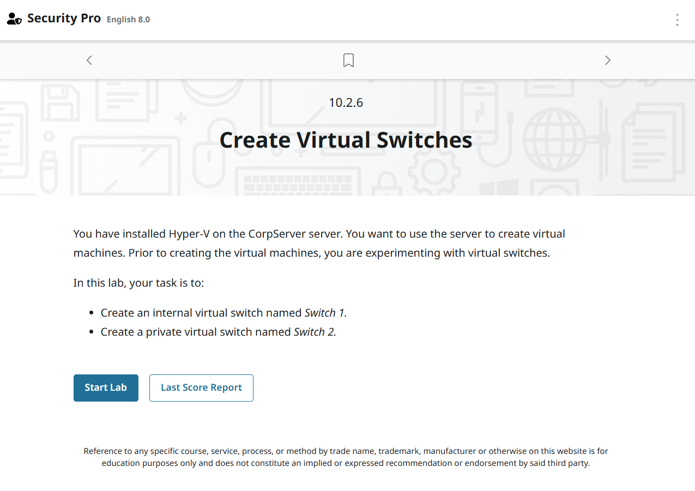
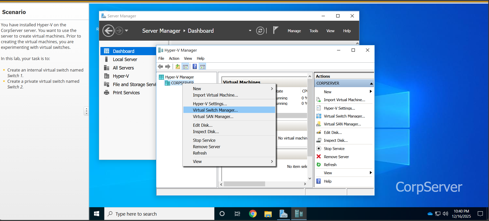
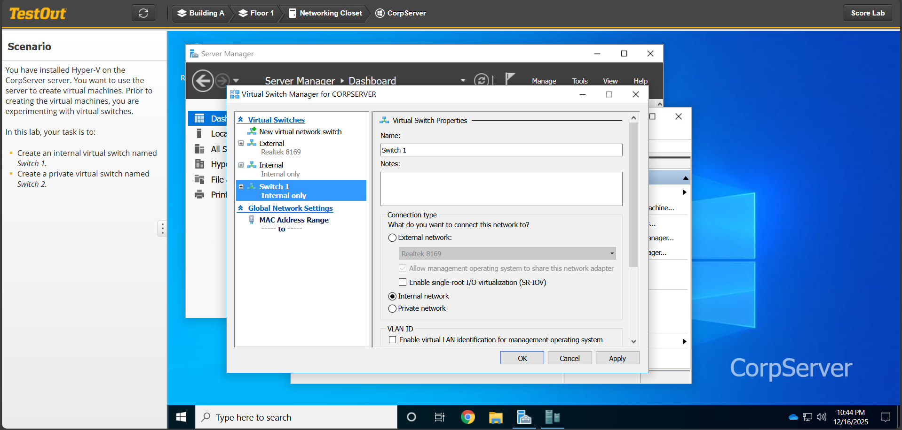
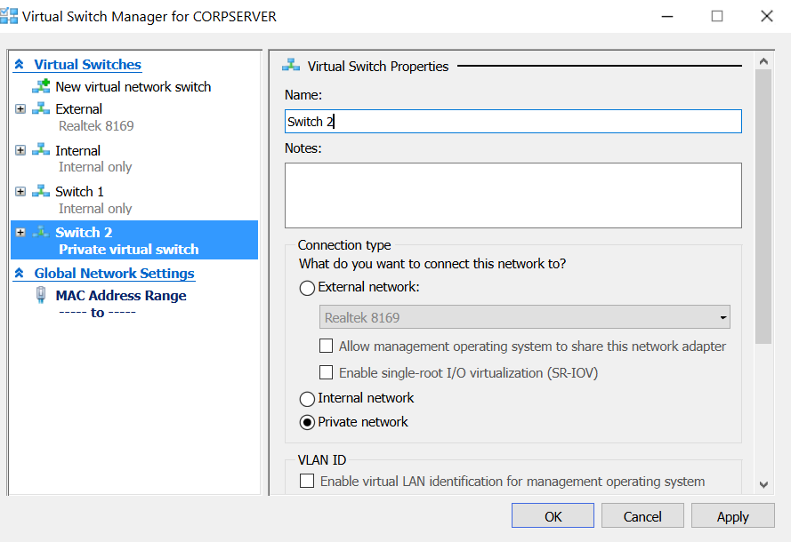
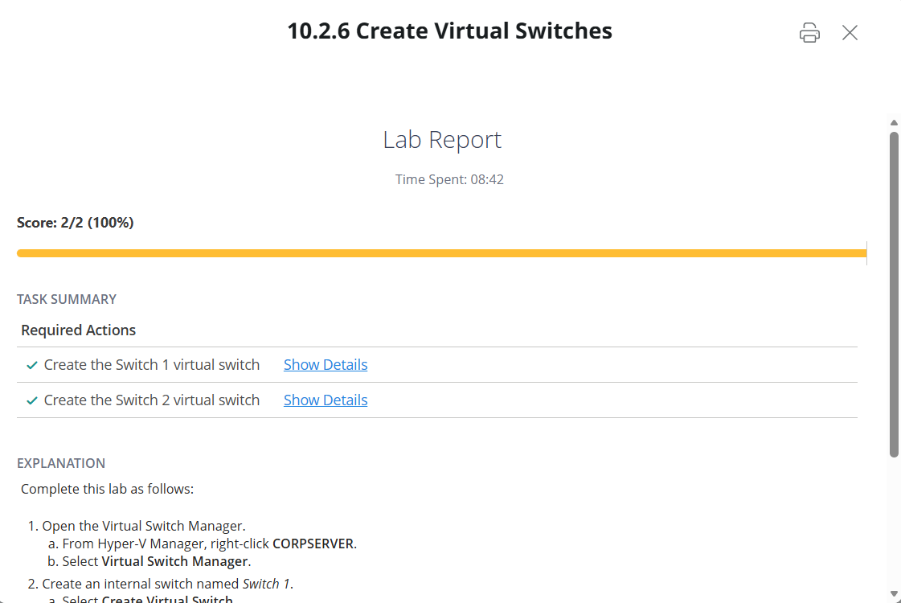

[<<back to Main](README.md)

## 10.2.6 Create Virtual Switches

โจทย์ : คุณได้ติดตั้ง Hyper-V บนเซิร์ฟเวอร์ CorpServer 
คุณต้องการใช้เซิร์ฟเวอร์เพื่อสร้างเครื่องจักรแบบ Virtual Switches  
ก่อนสร้างเครื่องเสมือน คุณกำลังทดลองกับ Virtual Switches
 โดยโจทย์ให้ทำดังนี้
    1. สร้าง internal virtual switch ชื่อ  "Switch 1"
    2. สร้าง private virtual switch ชื่อ  "Switch 2"

---

### วิธีการ 
    1. เปิด Virtual Switch Manager
        ในส่วน Hyper-V Manager ให้คลิกขวาที่ CORSERVER และเลือก Virtual Switch Manager

   

   ---
   
     2.  สร้างสวิตช์ ชื่อ Switch 1
               เลือกกด Create Virtual Switch. จากนั้นตั้งชื่อ Switch 1 
               เลือก Connection type โดยเลือกที่  Internal network.
               และกด Apply.

         

  ---

    3.  สร้างสวิตช์ Private ชื่อ Switch 2
                กดที่ New virtual network switch.
                 เลือกกด Create Virtual Switch. จากนั้นตั้งชื่อ Switch 2
                 เลือก Connection type โดยเลือกที่ Private network.
                  และกด Ok.

    

  ---

## ผลการทำ LAB

    

  ---
               
