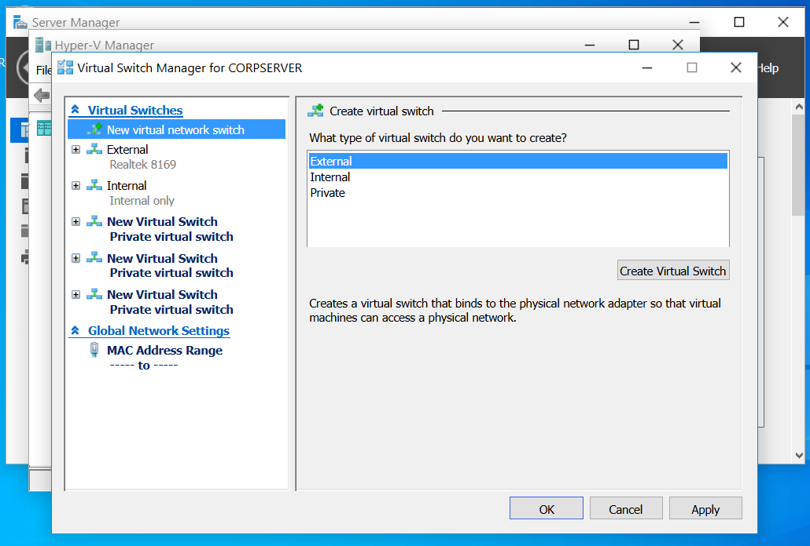

[<<back to Main](README.md)

## 10.2.6 Create Virtual Switches

โจทย์ : คุณได้ติดตั้ง Hyper-V บนเซิร์ฟเวอร์ CorpServer 
คุณต้องการใช้เซิร์ฟเวอร์เพื่อสร้างเครื่องจักรแบบ Virtual Switches  
ก่อนสร้างเครื่องเสมือน คุณกำลังทดลองกับ Virtual Switches
 โดยโจทย์ให้ทำดังนี้
    1. สร้าง internal virtual switch ชื่อ  "Switch 1"
    2. สร้าง private virtual switch ชื่อ  "Switch 2"

---

### วิธีการ 
    1. เปิด Virtual Switch Manager
        ในส่วน Hyper-V Manager ให้คลิกขวาที่ CORSERVER และเลือก Virtual Switch Manager

   

   ---
   
     2.  สร้างสวิตช์ ชื่อ Switch 1
               เลือกกด Create Virtual Switch. จากนั้นตั้งชื่อ Switch 1 
               เลือก Connection type โดยเลือกที่  Internal network.
               และกด Apply.

         

  ---

    3.  สร้างสวิตช์ Private ชื่อ Switch 2
                กดที่ New virtual network switch.

    
  
                 เลือกกด Create Virtual Switch. จากนั้นตั้งชื่อ Switch 2
                 เลือก Connection type โดยเลือกที่ Private network.
                  และกด Ok.
                  
    

  ---
  

## ผลการทำ LAB

    

  ---

## ภาคผนวก(คำศัพท์)

       1. Hyper-V :เทคโนโลยี Virtualization ของ Microsoft
          สำหรับสร้างและจัดการเครื่องเสมือน (Virtual Machine) บนเซิร์ฟเวอร์จริง
          พูดง่ายๆ คือ เครื่องมือแบ่งเซิร์ฟเวอร์เครื่องเดียวให้กลายเป็นหลายเครื่อง
          
  ---
  
      2. Server : เครื่องแม่ (Host) ที่ติดตั้ง Hyper-V เพื่อใช้เป็นศูนย์กลางในการสร้าง
          และควบคุมเครื่องเสมือน

  ---
  
      3. Virtual Machine (VM) : เครื่องคอมพิวเตอร์เสมือน ที่ทำงานเหมือนคอมพิวเตอร์จริง มีระบบปฏิบัติการ,
         IP, RAM, CPU เป็นของตัวเอง
         
  ---
  
      4. Virtual Switch : สวิตช์เครือข่ายแบบเสมือนใน Hyper-V
         ทำหน้าที่เชื่อมต่อเครือข่ายระหว่าง
         ✨ VM ↔ VM
         ✨ VM ↔ Host
         ✨ VM ↔ Network ภายนอก
         เปรียบเหมือน สวิตช์ LAN แต่ไม่มีตัวตนจริง
         
  ---
  
       5. Internal Virtual Switch : สวิตช์เสมือนที่ให้ VM ติดต่อกับ
           Host ได้ VM ติดต่อกับ VM อื่นได้ แต่ออกสู่เครือข่ายภายนอกไม่ได้
           
  ---  
  
       6. Private Virtual Switch : สวิตช์เสมือนที่ให้ VM ติดต่อกับ VM ด้วยกันเองเท่านั้น
          ไม่สามารถติดต่อ Host ได้ และออก Internet ไม่ได้
          
  ---
  
       7. Connection Type : การกำหนดรูปแบบการเชื่อมต่อของ Virtual Switch
          ว่าจะเป็น Internal, Private หรือ External
          
  ---
  
       8. Internal Network : รูปแบบเครือข่ายที่เชื่อมต่อเฉพาะ Host และ VM ภายในเครื่องเดียวกัน
       
  ---
  
       9. Private Network : เครือข่ายที่จำกัดการเชื่อมต่อเฉพาะ VM เท่านั้น ไม่มีการเชื่อมต่อกับ Host หรือภายนอก
       
  ---
  
       10. Create Virtual Switch : คำสั่งสำหรับเริ่มต้นสร้าง Virtual Switch ใหม่ในระบบ Hyper-V
       
  ---
  
       11. Apply / OK : คำสั่งยืนยันและบันทึกค่าการตั้งค่า Virtual Switch

  ---
