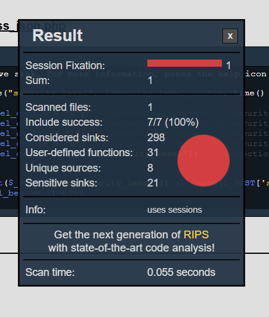

[<<back to Main](README.md)

# รายงานการแก้ไขช่องโหว่ Cross-Site Scripting (XSS)

---

## 1. แนะนำ Business Function ของหน้าที่นำมาทดสอบ

ไฟล์ที่เลือกมาทดสอบคือ

> index.php

หน้าดังกล่าวมีหน้าที่หลักคือ  
รับค่าจากผู้ใช้ผ่าน URL Parameter แล้วนำมาแสดงผลบนหน้าเว็บ

ตัวอย่างการทำงานปกติ

/index.php?name=Zero

ผลลัพธ์ที่ควรได้คือ

Hello Zero

ดังนั้น Business Function ของหน้านี้คือ  
“รับข้อมูลจากผู้ใช้ และแสดงข้อความตอบกลับ”

---

## 2. ช่องโหว่ที่พบ และการทดสอบก่อนแก้ไข

จากการตรวจสอบพบว่าโค้ดมีลักษณะดังนี้

### โค้ดที่มีช่องโหว่

print("Hello " . $_GET["name"]);

ปัญหาคือ  
มีการนำข้อมูลจากผู้ใช้มาแสดงผลทันทีโดยไม่มีการกรอง

---

### วิธีทดสอบว่ามีช่องโหว่จริง

ทดสอบโดยใช้ Payload ต่อไปนี้

/index.php?name=

---

### ผลการทดสอบก่อนแก้ไข

เมื่อเปิด URL ดังกล่าว  
ปรากฏหน้าต่าง alert ขึ้นมาจริง

แสดงว่า

> ระบบมีช่องโหว่ Cross-Site Scripting (XSS) จริง

---

## 3. ตรวจสอบช่องโหว่ด้วยเครื่องมือ RIPS

ทำการสแกนโค้ดด้วย RIPS Code Analysis Tool

ผลการสแกนแจ้งเตือนว่า

เครื่องมือยืนยันตรงกับการทดสอบในข้อ 2  
ว่าหน้านี้มีช่องโหว่ XSS

---

## 4. จุดที่เป็นต้นเหตุของปัญหา

สาเหตุของช่องโหว่เกิดจาก

- รับข้อมูลจากผู้ใช้ผ่าน `$_GET`
- นำไปแสดงผลโดยตรง
- ไม่มีการ Encode หรือกรองข้อมูล

ทำให้ผู้โจมตีสามารถแทรก JavaScript เพื่อ

- เปลี่ยนหน้าตาเว็บ (Defacement)
- ทำหน้า phishing
- ขโมย cookie
- ทำ Session Hijacking

> Session Hijacking คือ การที่ผู้โจมตีขโมย session ของเหยื่อ  
> แล้วนำไปใช้ปลอมตัวเป็นผู้ใช้คนนั้น

---

## 5. แนวทางการแก้ไข

หลักการสำคัญคือ

> “ห้ามนำข้อมูลจากผู้ใช้ไปแสดงผลตรง ๆ เด็ดขาด”

ต้องทำการ Encode ข้อมูลก่อนแสดงผลเสมอ

---

## 6. โค้ดที่แก้ไขเพื่อปิดช่องโหว่

### ก่อนแก้ไข (อันตราย)

print("Hello " . $_GET["name"]);

---

### หลังแก้ไข (ปลอดภัยแล้ว)

print("Hello " . htmlentities($_GET["name"], ENT_QUOTES, "utf-8"));

---

### คำอธิบาย

- `htmlentities()`  
  แปลงอักขระพิเศษให้เป็นข้อความปลอดภัย  
  เช่น `<` → `&lt;`

- `ENT_QUOTES`  
  ป้องกันการแทรกเครื่องหมาย `'` และ `"`

- `"utf-8"`  
  ระบุ charset ให้ถูกต้อง ป้องกันการ bypass

---

## 7. ทดสอบหลังแก้ไข (ใช้วิธีเดียวกับก่อนแก้)

ใช้ Payload เดิมในการทดสอบ

/index.php?name=

---

### ผลลัพธ์หลังแก้ไข

หน้าเว็บแสดงผลเป็นข้อความธรรมดา

Hello 

ไม่มีหน้าต่าง alert เกิดขึ้นอีก

แสดงว่า

> การโจมตี XSS ไม่สามารถทำได้แล้ว

---

## 8. ตรวจสอบว่า Business Function เดิมยังทำงานได้

ทดสอบการทำงานปกติอีกครั้ง

/index.php?name=Zero

ผลลัพธ์ยังคงเป็น

Hello Zero

---

### สรุปการเปรียบเทียบ

| การทดสอบ | ก่อนแก้ | หลังแก้ |
|--------|-------|-------|
| XSS Payload | alert ทำงาน | alert ไม่ทำงาน |
| การทำงานปกติ | ทำงานได้ | ทำงานได้ |

---

## 9. บทสรุป

การแก้ไขช่องโหว่ Cross-Site Scripting ทำได้โดย

- ไม่แสดงข้อมูลจากผู้ใช้โดยตรง
- ใช้ `htmlentities()` ทุกครั้งก่อนแสดงผล
- ตรวจสอบและ Encode input อย่างถูกต้อง

ผลลัพธ์คือ

> ระบบปลอดภัยจาก XSS  
> และยังทำงานตาม Business Function เดิมได้ปกติ

---

### สูตรจำง่าย

User Input + Direct Output = XSS ❌
User Input + Encode ก่อน Output = Safe ✅
