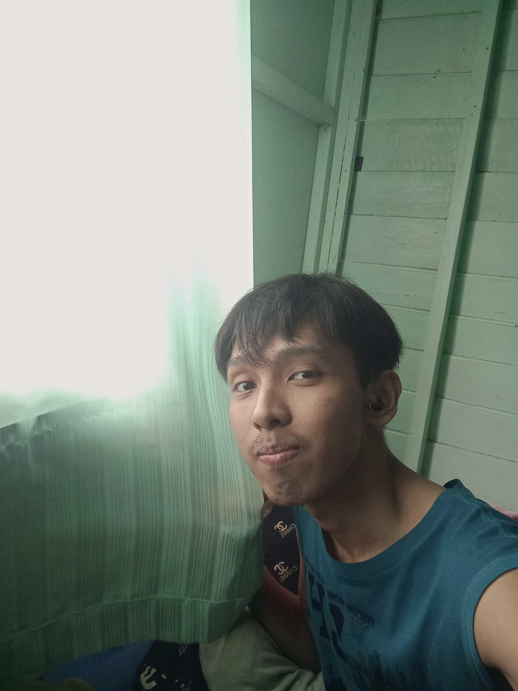

[<<back to Main](README.md)

## ผ้าม่าน (Curtain)

  ผ้าม่านเป็น Physical Security Control ที่มีลักษณะเป็น Preventative Control
  
      เหตุผลคือ...
        1.ควบคุมความเป็นส่วนตัว
              เนื่องจากสามารถป้องกันไม่ให้บุคคลภายนอกมองเห็นภายในอาคาร 
              และช่วยลดความเสี่ยงจากการถูกสอดแนมหรือเฝ้าดู
        2.ควบคุมการมองเห็น
              เพราะช่วยป้องกันการมองเห็นเอกสารสำคัญ หน้าจอคอมพิวเตอร์ หรือพื้นที่สำคัญภายในองค์กร
        3.มีหน้าที่เชิงป้องปราม
              เนื่องจากทำให้ผู้ไม่ประสงค์ดีเข้าถึงข้อมูลได้ยากขึ้น และช่วยลดโอกาสการโจรกรรมข้อมูล
              หรือการกระทำที่เป็นภัยต่อความปลอดภัย
        4.ควบคุมแสงสว่าง
              เพราะสามารถปรับระดับแสงเพื่อลดการมองเห็นจากภายนอก และช่วยป้องกันแสงจ้าที่ส่องเข้าตา 
              ซึ่งอาจทำให้มองเห็นข้อมูลบนหน้าจอได้ง่ายเกินไป

  ---
